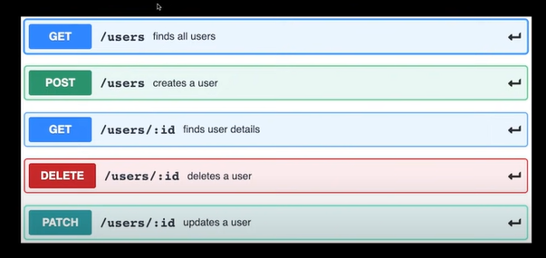

## Overview

RESTful API with CRUD Operations using Node.js and Express

## Features
Operations implemented:

- Create new resource
- Read existing resource(s)
- Update existing resource
- Delete existing resource

## Requirements

- Node.js (version >= 10)
- npm (Node Package Manager) or yarn

## Installation
1. Clone the repository: `git clone https://github.com/KumaarBalbir/RESTful-CRUD.git`
2. Navigate to the project directory: `cd RESTful-CRUD`
3. Install dependencies: `npm install`

## Usage
1. Start the server: `npm start` (nodemon)
2. The server will start running on `http://localhost:3000` by default.

## Endpoints

- **GET /users**: Retrieve all users.
- **GET /users/:id**: Retrieve a specific user by ID.
- **POST /users**: Create a new user.
- **PUT /users/:id**: Update an existing user by ID.
- **DELETE /users/:id**: Delete a user by ID.

## Request and Response Formats

### Create User (POST /users)

Request Body:
```json
{
  "firstName": "Balbir",
  "lastName": "Prasad",
  "age": "23"
}

```
### Get users (GET /users)
Response
```json
[
{
  "id": "user-id",
  "firstName": "Balbir",
  "lastName": "Prasad",
  "age": "23"
},
{
  "id": "user-id",
  "firstName": "John",
  "lastName": "Doe",
  "age": "25"
},

]
```
### Get user (GET /users/:id) 
Response 
```json
{
  "id": "id",
  "firstName": "Balbir",
  "lastName": "Prasad",
  "age": "23"
}
```

### Update user (PATCH /users/:id)
Request Body
```json
{
  "age": "20"
}
```

### Delete user (DELETE /users/:id)
Response: User with id 1234 deleted

